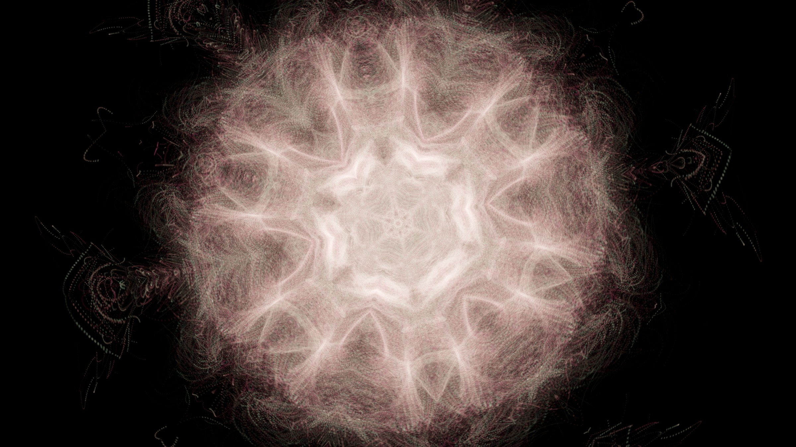
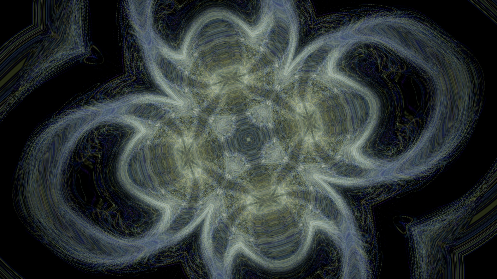
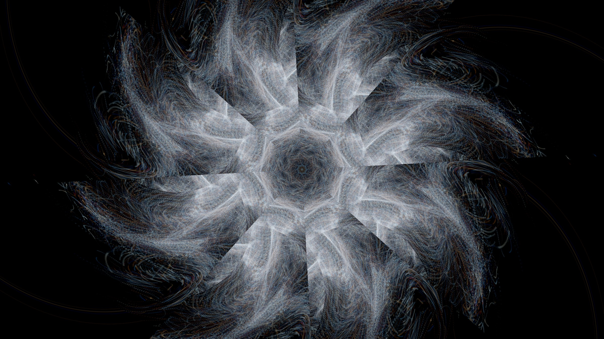
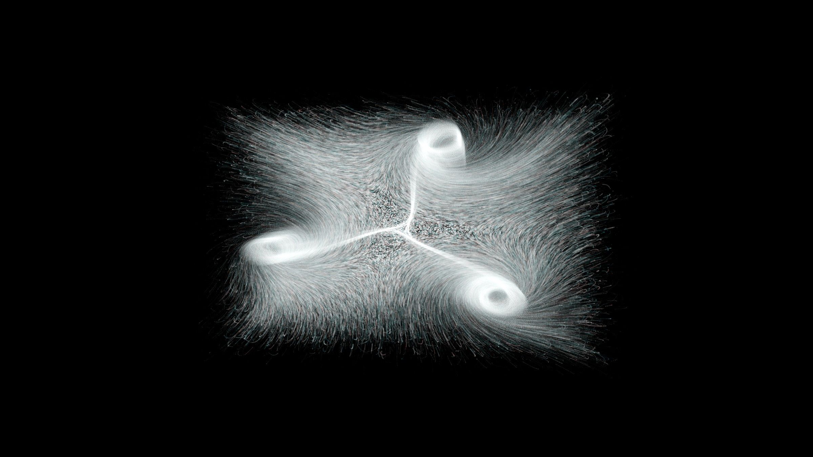

# KaleidoFlow

A generative, music-driven **kaleidoscope** built on a GPU particle **flow field** — the
two ideas its name fuses. Drop in a track and it analyzes the whole song offline,
then plays back a continuously **evolving symmetric** visual that morphs in time
with the music: a calm radial mandala that turns and blooms into triangles,
grids, quads and orbiting forms, then eases back to center — all with smooth,
seamless transitions.

The aesthetic north star is Refik Anadol's *Unsupervised* — flowing "data
pigment," soft morphing colour fields, organic and alive — rather than the
hard, reactive look of classic spectrum visualizers.

> Built with React + Three.js (plain WebGL, no react-three-fiber) and a GPGPU
> particle simulation. No build-time assets beyond a bundled demo track.



---

## How it works

KaleidoFlow is deliberately **not** a real-time FFT bar visualizer. It runs in
two phases:

1. **Offline analysis** (`src/audio/`). When a track loads, the whole file is
   decoded and analyzed once into a `FlowMap`: tempo + beat timestamps (via
   `web-audio-beat-detector`) and normalized loudness / bass / mid / treble
   envelopes (via offline `BiquadFilter` renders). The `<audio>` element is then
   the clock; each frame samples the precomputed timeline.

2. **GPU render pipeline** (`src/visualizer/`):
   - A **GPGPU particle simulation** (`GPUComputationRenderer`, 512×512 ≈ 262k
     particles) advects points through a **curl-noise flow field** (divergence-free,
     so it swirls without sources/sinks).
   - Particles draw additively into **feedback/trail buffers** for the inky,
     smoky texture.
   - A **display pass** folds the trail through a kaleidoscope, tone-maps
     (Reinhard), vignettes, and applies a cosine-gradient palette.
   - The music drives **light and colour** (brightness, contrast, auto-exposure,
     hue, palette spread) — intentionally *not* particle motion, so the flow
     stays smooth and never jitters on the beat.

### The transition model (the interesting part)

Symmetry is produced by a post-process **fold** of the screen, and the hard part
was making the design *evolve* between fold patterns without jarring cuts. The
solution that made it click:

- The resting state is a clean radial kaleidoscope. A `seamStrength` blends the
  unfolded field → folded pattern, so **seams emerge from and collapse back into**
  the symmetric base.
- Each transition **dips the seam through zero at its midpoint** and swaps the
  fold structure exactly there — where every pattern looks identical — so
  structural changes are invisible. No re-tiling pop.
- Whole-screen rotation lives mostly **in transitions** (the "turn" of the
  kaleidoscope), easing straight to a pre-chosen **left-right-symmetric** resting
  angle so pauses are never tilted.

## Modes

Pick a mode from the top bar. All four are auto-choreographed — they evolve on
their own and react to the music.

| Mode | What it is |
|------|------------|
| **evolving symmetry** *(default)* | Clean radial home that turns/morphs into radials (square, pentagon, hexagon, octagon…) and axis-aligned **grids/quads** — always at least a **four-way split**, never a lopsided single mirror. The headline mode. |
| **evolving surface** | Symmetry lives in the **force field** (N evenly-spaced swirl sources) rather than a post fold — a "water surface" where particles bubble up and sink. |
| **evolving morph** | A continuous N-fold dihedral morph journey (the original symmetry engine), exploring point counts 4–16. |
| **evolving pinwheel** | Rotational (cyclic) symmetry with **no mirror seams** — reads more like a spiral/pinwheel. |

<table>
  <tr>
    <td align="center"><br><sub><b>evolving morph</b> · Aurora</sub></td>
    <td align="center"><br><sub><b>evolving pinwheel</b> · Ice</sub></td>
  </tr>
  <tr>
    <td align="center"><br><sub><b>evolving surface</b> · Ember</sub></td>
    <td align="center"><br><sub><b>evolving symmetry</b> · Magma</sub></td>
  </tr>
</table>

*(Stills from the bundled demo track. The palette — Magma, Aurora, Ice, Ember… — is cycled live with `P`.)*

## Controls

- **Top bar** — load the demo track or your own audio file, play/pause, and pick a mode.
- **Keyboard** (live tuning; the info line at the bottom shows current values):
  - `P` — cycle colour palette
  - `[` / `]` — slower / faster flow-field **evolve** (`\` freezes it)
  - `,` / `.` — slower / faster particle **breathing**
  - `-` / `=` — particle **size**
  - `s` / `S` — **seam** softness (feather + wavy)
  - `b` / `B` — **trail blur**

## Running it

```bash
npm install
npm run dev      # open the printed localhost URL
npm run build    # typecheck + production build to dist/
```

Requires a WebGL2-capable browser. Best in Chrome/Edge/Firefox on a discrete or
recent integrated GPU.

## Project layout

```
src/
  App.tsx              UI: transport + mode bar, info line, audio element
  main.tsx             React entry (no StrictMode — avoids double WebGL context)
  styles.css
  audio/
    analyzer.ts        offline decode → FlowMap (tempo, beats, band envelopes)
    flowmap.ts         FlowMap type + FlowPlayer (samples the timeline each frame)
  visualizer/
    Visualizer.ts      the engine: GPGPU sim, passes, fold shaders, mode drivers
    glsl.ts            shared GLSL (simplex/curl noise, hashes, value noise)
public/
  techno-01.mp3        bundled demo track
```

## Credits & licence

- Released under the **MIT License** (see `LICENSE`).
- Simplex/curl noise based on the Ashima / Stefan Gustavson implementations.
- Cosine-gradient palettes after Inigo Quilez.
- The bundled `techno-01.mp3` is a generated demo track included for convenience;
  replace it with your own audio via "Load file…".
